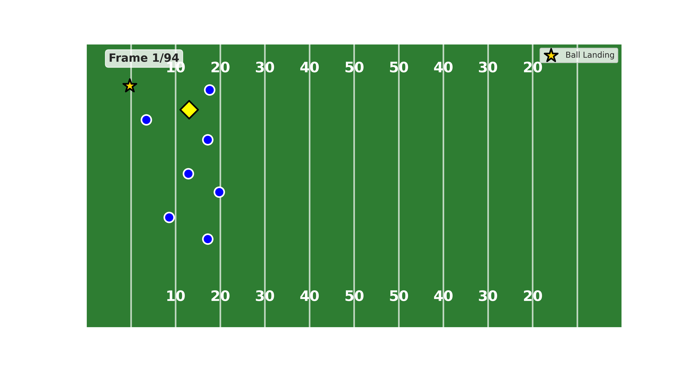
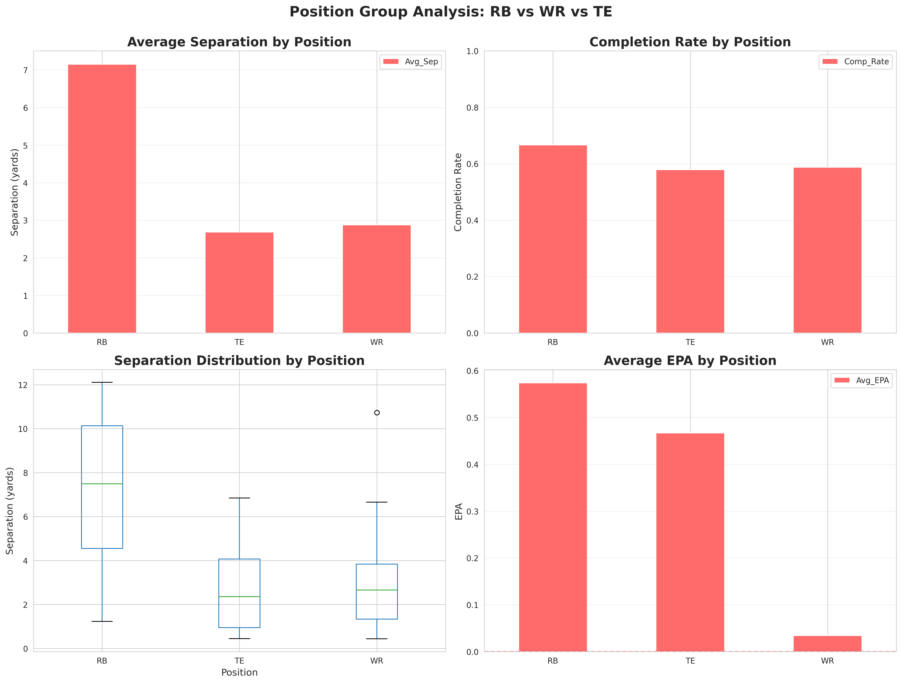
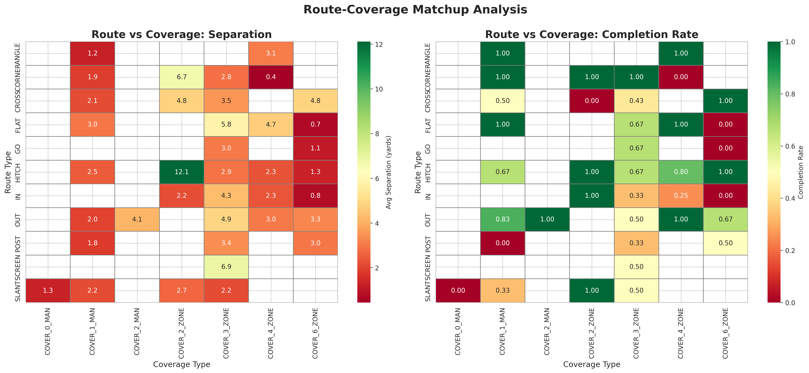
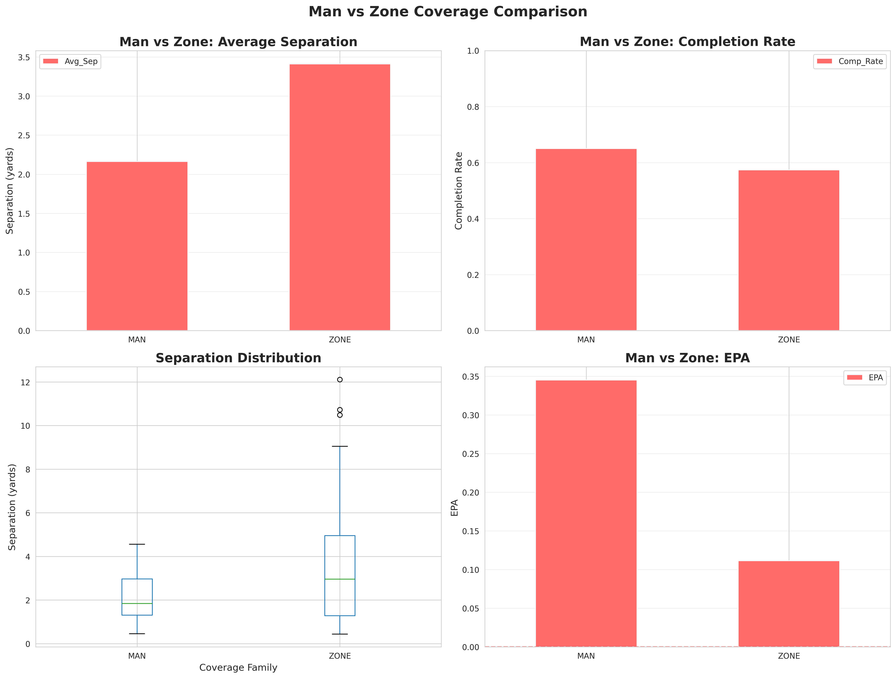
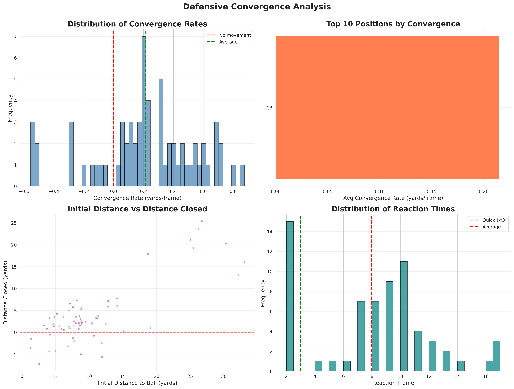
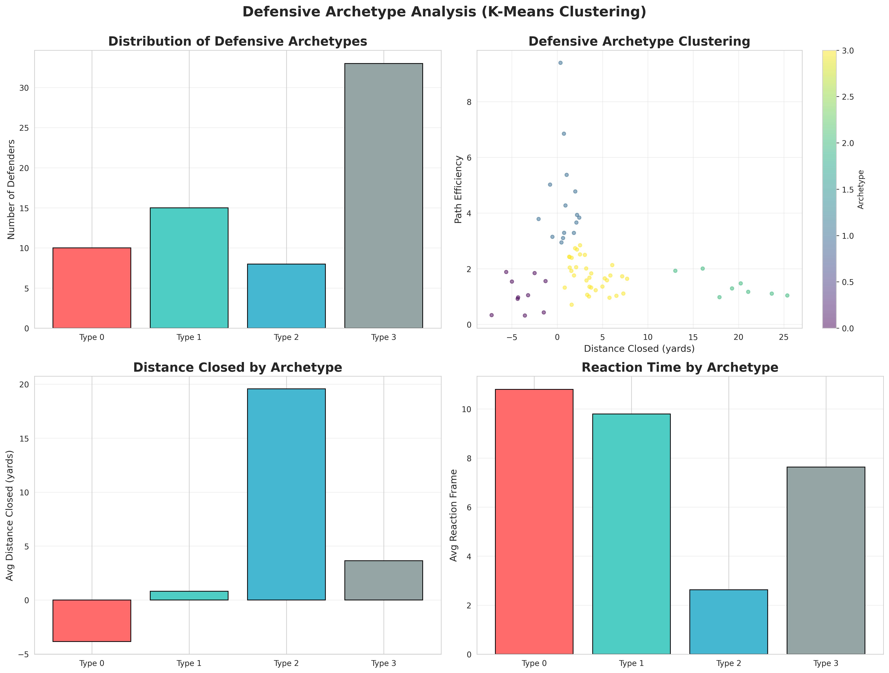
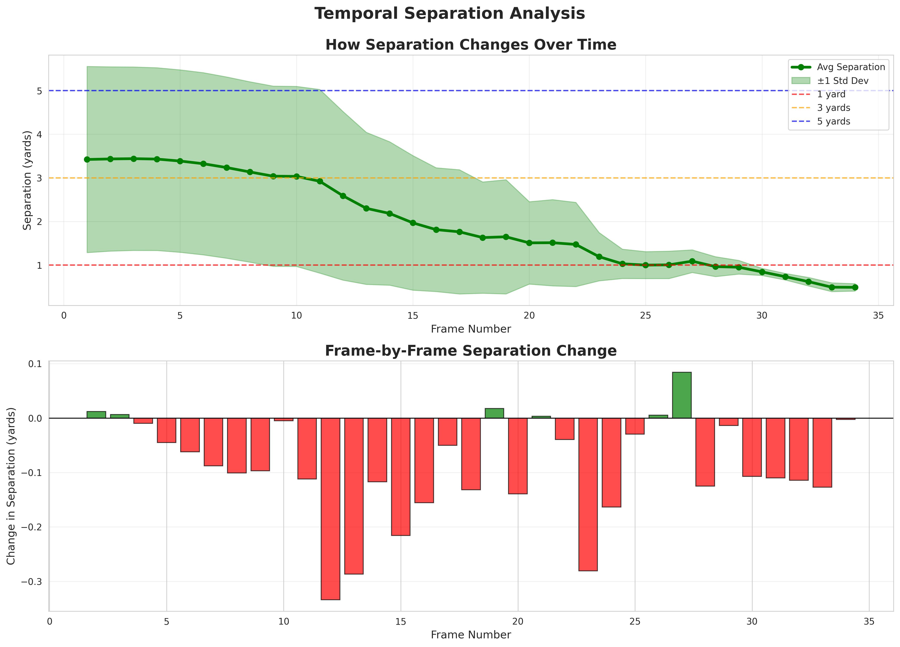
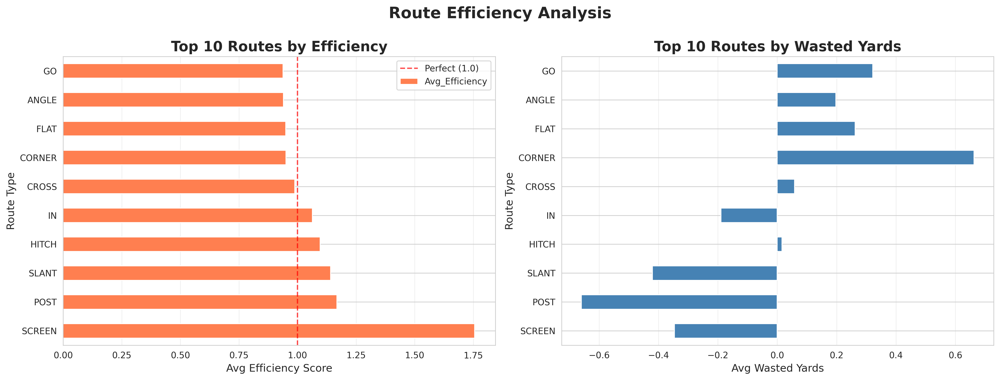
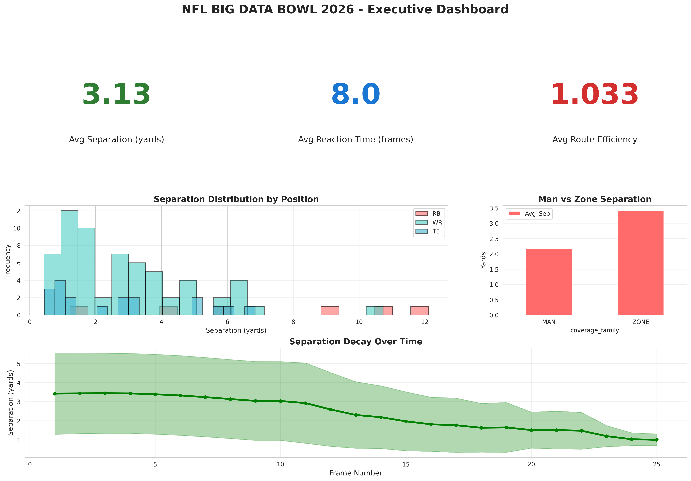

# NFL Big Data Bowl 2026 – Spatial & Temporal Pass Play Analysis

Frame-level tracking analysis of receiver separation, defensive reaction timing, coverage structure, and route efficiency using the NFL Big Data Bowl 2026 Kaggle dataset.

---

## Executive Summary

This project analyzes NFL pass plays using player tracking data to quantify:

- Receiver separation at catch point  
- Coverage structure effects (Man vs Zone)  
- Route–coverage interaction efficiency  
- Defensive reaction timing and convergence behavior  
- Defensive archetypes using clustering  
- Temporal decay of separation  
- Route geometric efficiency  
- Completion probability using early spatial features  

### Key Results

- Mean separation: **3.13 yards**
- Completed passes show **+1.32 yards more separation** than incompletions (p = 0.0109)
- Zone coverage allows **1.25 more yards** than man (p = 0.042)
- Early separation is the strongest predictor in logistic regression (AUC = 0.69)
- Defensive clustering silhouette score: **0.569**

---

## Tracking Visualization (Frame-Level Animation)

This animation visualizes frame-level player coordinates, ball landing location, and evolving spatial separation.

**Interpretation:**  
Separation is dynamic and evolves frame-by-frame. Defensive reaction timing and pursuit acceleration directly shape the catch window.

---

## Dataset Overview

- 285,714 tracking records  
- 32,088 processed tracking observations  
- 18,009 total plays  
- 819 unique pass plays  
- 737 players  

### Analysis Subsets
- 88 plays with valid separation data  
- 66 defender movement sequences  
- 500 routes analyzed  
- 2,701 frame-level separation observations  
- 734 modeling samples  

---

## Methodology

**Separation Definition:**  
Euclidean distance between receiver and nearest defender at catch frame.

**Reaction Time:**  
First frame where defender significantly changes pursuit direction toward target.

**Convergence Rate:**  
(distance_initial − distance_final) / frames_elapsed

**Route Efficiency:**  
Actual path length / optimal straight-line displacement.

### Statistical Testing
- Two-sample t-tests for separation comparisons
- Coverage family hypothesis testing

### Clustering
- K-Means (k = 4)
- Standardized defender movement features
- Silhouette score evaluation

### Modeling
- Logistic regression
- Features: `early_separation`, `reaction_time`
- Cross-validated ROC-AUC

---

## Separation at Catch Point

- Mean separation: 3.13 yards  
- Completed passes: 3.67 yards  
- Incomplete passes: 2.35 yards  
- Difference: 1.32 yards  
- p-value: 0.010885  

**Interpretation:**  
Separation magnitude is statistically associated with completion probability.

**Football Insight:**  
Marginal spatial gains (~1 yard) significantly alter throwing viability.

---

## Position Group Analysis

Average Separation:
- RB: 7.15 yards
- WR: 2.88 yards
- TE: 2.69 yards

RB vs WR:
- t = 4.53
- p < 0.000025

**Interpretation:**  
RB separation is statistically higher but likely influenced by route type (screens/checkdowns). Sample imbalance should be considered.

**Football Insight:**  
Position-based separation reflects usage structure more than raw skill differential.

---

## Route–Coverage Interaction

Examples:
- CROSS vs Cover 3 Zone: 3.53 yards
- OUT vs Cover 1 Man: 83% completion

**Interpretation:**  
Coverage shell significantly impacts route-level spacing.

**Football Insight:**  
Offensive play design can exploit predictable structural coverage weaknesses.

---

## Man vs Zone Coverage

Zone:
- Avg separation: 3.41 yards
- EPA: 0.111

Man:
- Avg separation: 2.16 yards
- EPA: 0.345

Difference: 1.25 yards  
p = 0.042  

**Interpretation:**  
Zone coverage concedes more space but reduces explosive impact. Man compresses space but increases variance.

**Football Insight:**  
Defensive scheme choice represents a spatial–risk tradeoff.

---

## Defensive Convergence & Reaction Timing

- Avg convergence rate: 0.217 yards/frame
- Avg reaction frame: 8
- Quick reactors (<3 frames): 22.7%
- Slow reactors (>10 frames): 21.2%

**Interpretation:**  
Reaction timing varies significantly across defenders.

**Football Insight:**  
The first second after route break is critical for contesting catch windows.

---

## Defensive Archetype Clustering

K-Means (k = 4)  
Silhouette Score: 0.569  

Archetypes:
- Zone Sitters
- Cautious Reactors
- Ball Hawks
- Aggressive Convergers

**Interpretation:**  
Defensive pursuit behavior clusters into measurable movement profiles.

**Football Insight:**  
Tracking-based behavioral archetypes can support personnel evaluation.

---

## Temporal Separation Decay

- Initial separation (frame 1): 3.42 yards  
- Frame 20: 1.51 yards  
- Decay rate: 0.096 yards/frame  

**Interpretation:**  
Separation decays approximately linearly across early frames.

**Football Insight:**  
Delayed quarterback decisions shrink spatial margin predictably.

---

## Route Path Efficiency

- Average efficiency: 1.033  
- Average wasted yards: 0.084  

Most efficient route: SCREEN (1.756)

**Interpretation:**  
Short-developing routes minimize geometric inefficiency.

**Football Insight:**  
Route geometry and spatial economy are quantifiable performance dimensions.

---

## Executive Dashboard

Key Metrics:
- Avg separation: 3.13 yards
- Avg reaction time: 8 frames
- Avg route efficiency: 1.033

---

## Completion Probability Modeling

Logistic Regression Results:

- ROC-AUC: 0.6689  
- Cross-Validated AUC: 0.6916  

Model Coefficients:
- early_separation: 0.313
- reaction_time: 0.139

**Interpretation:**  
Early separation contributes more strongly to completion probability than reaction timing.

**Limitation:**  
Model excludes down-distance, pressure, QB movement, and trajectory features.

---

## Coverage Breakdown Timing

- Average breakdown frame: 3.59

**Interpretation:**  
Coverage failure often occurs within the first few frames post-snap.

**Football Insight:**  
Early structural integrity is critical for pass defense success.

## Tech Stack

- Python  
- Pandas  
- NumPy  
- SciPy  
- Scikit-learn  
- Matplotlib / Seaborn  
- Kaggle NFL Big Data Bowl Dataset  

---

## Conclusion

This project demonstrates that:

- Separation is statistically predictive of completion
- Defensive pursuit behavior is clusterable
- Early spatial advantage is a stronger predictor than reaction timing alone
- Coverage structure materially shapes spacing outcomes
- Temporal decay of separation is measurable and consistent

The analysis transitions tracking data from visualization into quantitative, testable football analytics.

Article: https://medium.com/@shambhaviadhikari/nfl-big-data-bowl-2026-e94a31980429

